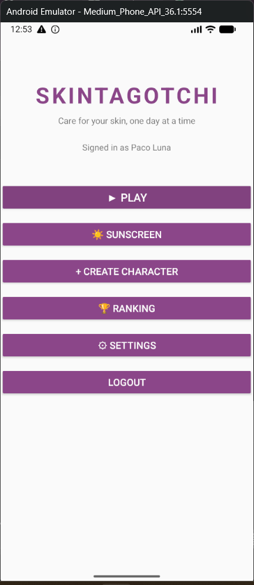
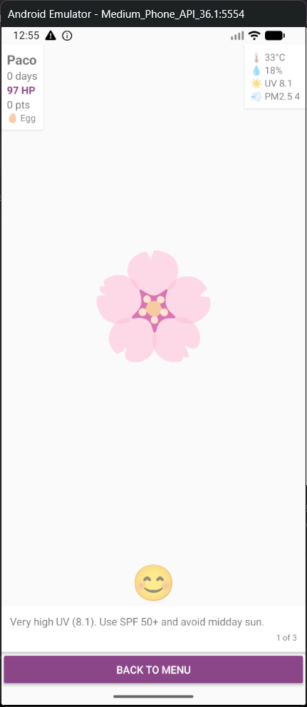
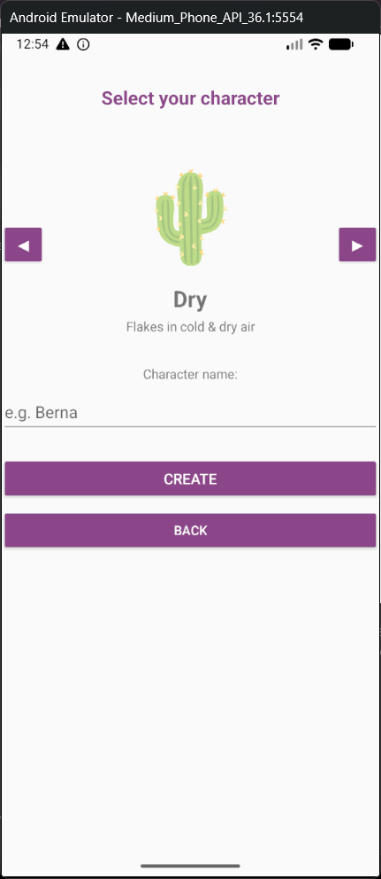
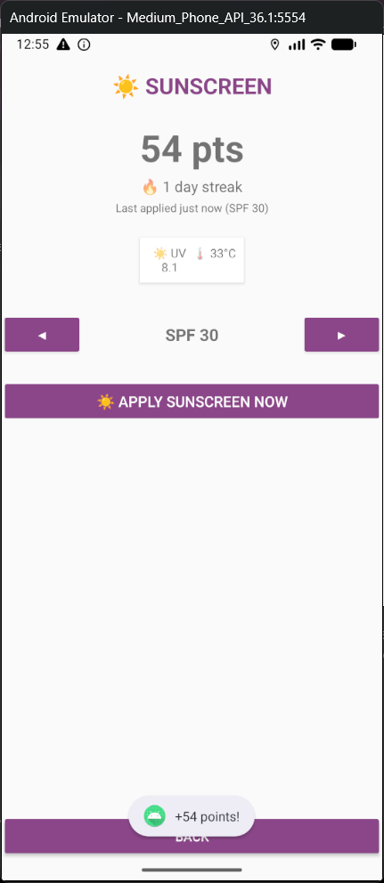
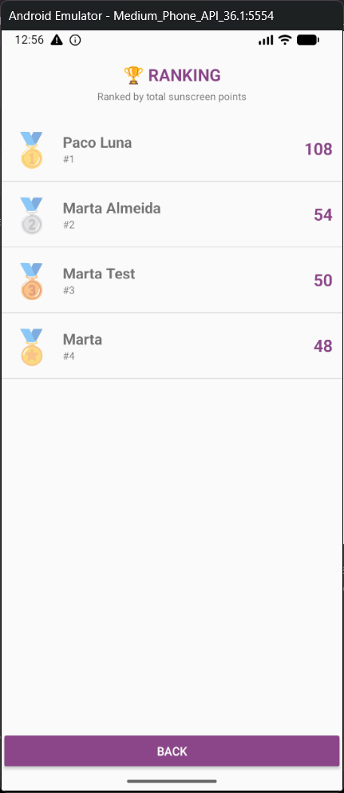
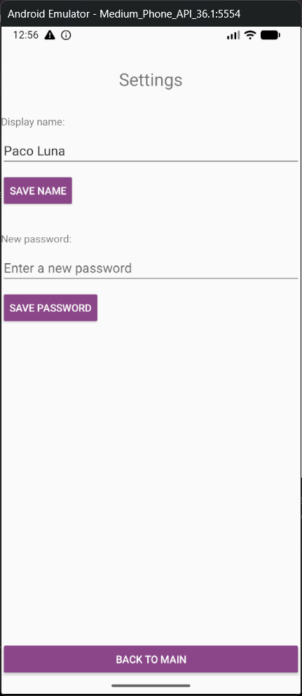

# Skintagotchi

## Workspace

**Github:**

* Repository: https://github.com/marta-almeida-bt0122/MobileAppDevelopment
* Releases: https://github.com/marta-almeida-bt0122/MobileAppDevelopment/releases

**Workspace:**

* https://upm365.sharepoint.com/sites/MobileAppDevelopment41

---

## Description

Skintagotchi is a gamified skincare companion. Instead of tracking abstract stats, it rewards a real, daily habit — applying sunscreen — by scoring it against the actual environmental conditions at the user's location and time of day: the current UV index, temperature, and how risky the hour of application is (protecting yourself at solar noon is worth more than at 9am). Consistency is rewarded too: a streak multiplier grows the longer you keep the habit up, and resets if a day is skipped.

On top of the points system, the app keeps an optional virtual skin character (egg → baby → adult) whose HP reacts to the same live environmental data (UV, temperature, humidity, air quality), giving instant, playful feedback on days when conditions are harsh — similar in spirit to a Tamagotchi, but grounded in real weather data instead of arbitrary timers.

Compared to generic habit trackers (which just log a checkbox) or weather apps (which show data but don't reward acting on it), Skintagotchi ties the two together: the environmental reading *is* the scoring input, so the incentive to act is strongest exactly when it matters most.

---

## Screenshots and navigation

| Screenshot | Screenshot |
|---|---|
|  |  |
| **Main menu** — entry point after login, with quick access to Play, Sunscreen, Create Character, Ranking and Settings. | **Create character** — pick a skin type (dry, mixed, oily, sensitive) and name your character. |
|  |  |
| **Character (Play)** — the optional HP layer: live UV/temperature/humidity/PM2.5 telemetry and skincare recommendations for the current conditions. | **Sunscreen** — the core loop: fetches live environment data at your location, scores the habit, and logs it. |
|  |  |
| **Ranking** — global leaderboard comparing every user's total sunscreen points. | **Settings** — update your display name or password (Firebase Authentication). |

---

## Features

### Functional Features

* Log "applied sunscreen" and earn points based on live UV index, temperature, time of day and streak
* Consecutive-day streak with a growing multiplier that resets if a day is skipped
* Global ranking comparing all users by total points
* Optional virtual skin character (dry / mixed / oily / sensitive) with an HP stat driven by the same live environmental data
* Personalized skincare recommendations based on current conditions
* Background reminder notification when UV is high and no sunscreen has been logged recently

### Technical Features

* Firebase Authentication (email/password, via FirebaseUI)
* Firebase Realtime Database (points sync, global ranking, character state)
* Room database (local persistence of the character and sunscreen log history)
* Retrofit + Gson for API communication
* RESTful APIs (no API key required):
  * [Open-Meteo Forecast API](https://open-meteo.com/en/docs) — UV index, temperature, humidity
  * [Open-Meteo Air Quality API](https://open-meteo.com/en/docs/air-quality-api) — PM2.5
* WorkManager (periodic background environment check + reminder notifications)
* GPS location (fresh single-fix request, not just the last cached location)
* Notification system (alerts for high UV / low HP / character events)
* Glide (image loading)

---

## How to Use

1. Launch the application and sign in (or sign up) with email and password.
2. From the main menu, tap **Sunscreen** to log your habit: the app fetches your GPS location, reads the live UV index and temperature, and awards points.
3. Check **Ranking** to see how your total points compare with other users.
4. Optionally, tap **Create Character** to start a virtual skin character; its HP reacts to the same environmental data over time. Tap **Play** to check on it.
5. Use **Settings** to change your display name or password.

---

## Participants

* Marta Almeida ([marta.almeida@alumnos.upm.es](mailto:marta.almeida@alumnos.upm.es))

Workload distribution: 100%

---

## Releases

- [Latest Release (v1.0)](https://github.com/marta-almeida-bt0122/MobileAppDevelopment/releases)
